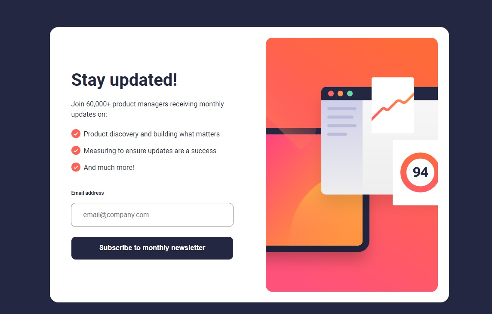

# Frontend Mentor - Newsletter sign-up form with success message solution

This is a solution to the [Newsletter sign-up form with success message challenge on Frontend Mentor](https://www.frontendmentor.io/challenges/newsletter-signup-form-with-success-message-3FC1AZbNrv). Frontend Mentor challenges help you improve your coding skills by building realistic projects. 

## Table of contents

- [Overview](#overview)
  - [The challenge](#the-challenge)
  - [Screenshot](#screenshot)
  - [Links](#links)
- [My process](#my-process)
  - [Built with](#built-with)
  - [What I learned](#what-i-learned)
- [Author](#author)

## Overview

### The challenge

Users should be able to:

- View the optimal layout for the component depending on their device's screen size
- See the social media share links when they click the share icon

### Screenshot

### Links

- Solution URL: [GitHub]()
- Live Site URL: [Netlify]()

## My process

### Built with

- Semantic HTML5 markup
- CSS custom properties
- Flexbox
- Mobile-first workflow
- JavaScript Vanilla

## Author

- Linkedin - [Pablo Zallio](https://www.linkedin.com/in/pablo-damian-zallio-zabala-140b83278/)
- GitHub - [Pablo-Zallio-Dev](https://github.com/Pablo-Zallio-Dev)
- Frontend Mentor - [@Pablo-Zallop-Dev](https://www.frontendmentor.io/profile/Pablo-Zallio-Dev)